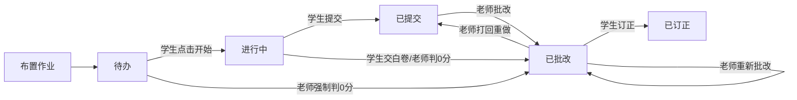
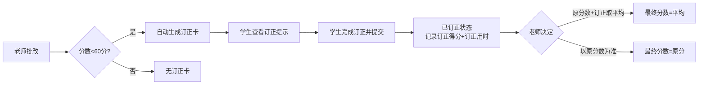
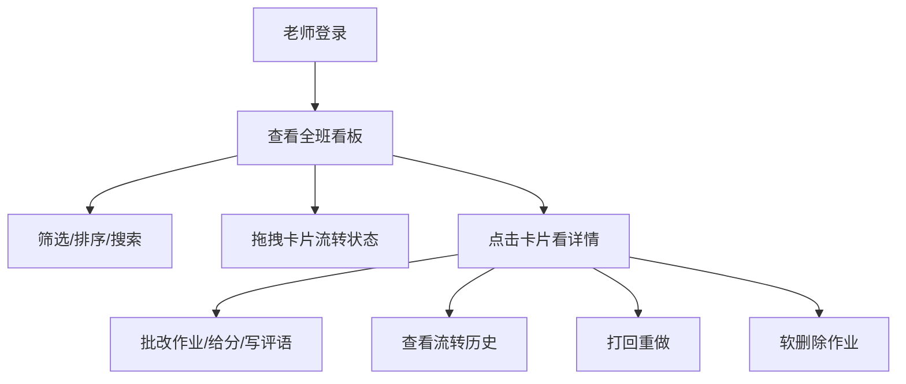
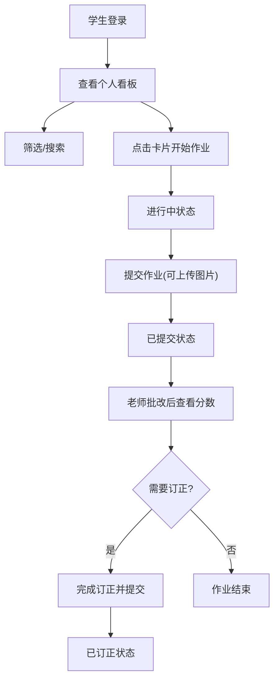

## 1. 产品概述

中学作业看板系统是一款面向校园内网环境的在线作业管理工具，通过 Kanban 看板的形式直观展示作业流转状态，支持老师和学生两种身份登录使用。系统基于浏览器本地 IndexedDB 存储数据，无需后端服务器，部署简单，适合校园内网场景。

- **核心目标**：通过可视化看板提升作业管理效率，让老师和学生清晰掌握作业进度
- **目标用户**：中学老师和学生
- **核心价值**：作业状态透明化、流程规范化、订正管理系统化

## 2. 核心功能

### 2.1 用户角色

| 角色 | 登录方式 | 核心权限 |
|------|----------|----------|
| 老师 | 身份选择登录 | 查看全班作业看板、布置作业、批改作业、拖拽流转所有状态、删除/软删除作业、筛选排序搜索 |
| 学生 | 身份选择登录 | 查看个人作业看板、开始作业、提交作业、订正作业、筛选搜索 |

### 2.2 功能模块

1. **看板视图模块**：5 列布局（待办、进行中、已提交、已批改、已订正）、作业卡片渲染、拖拽交互
2. **状态机模块**：作业状态转移规则校验、事件触发、非法转移拦截
3. **身份权限模块**：老师/学生身份切换、视图差异化、操作权限控制
4. **作业数据模块**：IndexedDB 存储、CRUD 操作、图片附件存储（base64）
5. **订正流程模块**：订正卡自动生成、订正分数管理、订正用时记录
6. **流转历史模块**：事件日志记录、历史回溯查看、时间倒序展示
7. **筛选排序搜索模块**：按科目/学生筛选、按截止时间排序、关键字搜索

### 2.3 页面详情

| 页面名称 | 模块名称 | 功能描述 |
|----------|----------|----------|
| 登录页 | 身份选择 | 选择老师/学生身份，选择具体身份（学生姓名/老师姓名），进入看板 |
| 老师看板页 | 顶部导航 | 角色徽章、科目筛选、学生筛选、排序切换、搜索框、登出 |
| 老师看板页 | 看板主体 | 5 列布局，按学生分组展示作业卡片，支持拖拽流转 |
| 老师看板页 | 作业卡片 | 科目色条、题号简述、布置/截止/提交时间、分数、评语、学生姓名 |
| 老师看板页 | 作业详情弹窗 | 完整作业信息、图片附件预览、流转历史、批改/打回操作 |
| 学生看板页 | 顶部导航 | 角色徽章、科目筛选、状态筛选、搜索框、登出 |
| 学生看板页 | 看板主体 | 5 列布局，个人作业卡片，支持有限拖拽 |
| 学生看板页 | 作业卡片 | 科目色条、题号简述、布置/截止/提交时间、分数、评语、订正提示 |
| 学生看板页 | 作业详情弹窗 | 完整作业信息、图片附件上传、流转历史、开始/提交/订正操作 |

## 3. 核心流程

### 3.1 作业完整生命周期

### 3.2 订正流程

### 3.3 老师操作主流程

### 3.4 学生操作主流程

## 4. 用户界面设计

### 4.1 设计风格

- **整体风格**：清爽现代的教育类应用风格，卡片式布局，强调信息层级
- **设计理念**：以颜色区分科目，以列区分状态，以分组区分学生
- **交互风格**：拖拽流畅，反馈及时，动画柔和

**配色方案**：
- **老师端主色**：深邃蓝 `#1e40af`，辅以暖橙 `#f97316` 作为强调色
- **学生端主色**：活力绿 `#059669`，辅以天蓝 `#0ea5e9` 作为强调色
- **科目颜色**：
  - 语文：砖红 `#dc2626`
  - 数学：深蓝 `#2563eb`
  - 英语：紫色 `#7c3aed`
  - 物理：青色 `#0891b2`
  - 化学：橙色 `#ea580c`
  - 生物：绿色 `#16a34a`
- **背景色**：浅灰 `#f8fafc`，卡片白色 `#ffffff`
- **文字色**：深灰 `#1e293b`，次灰 `#64748b`

**字体**：
- 标题：`"PingFang SC", "Microsoft YaHei", system-ui, sans-serif`，加粗
- 正文：`"PingFang SC", "Microsoft YaHei", system-ui, sans-serif`，常规
- 数字/分数：等宽字体感，醒目

**按钮风格**：
- 主按钮：圆角 8px，实心背景，hover 轻微加深
- 次按钮：圆角 8px，描边样式，hover 填充浅背景
- 危险按钮：红色系，用于删除等操作

### 4.2 页面设计概览

| 页面名称 | 模块名称 | UI 元素 |
|----------|----------|---------|
| 登录页 | 身份选择 | 居中卡片布局、双角色切换按钮、身份下拉选择、进入按钮、柔和渐变背景 |
| 老师看板 | 顶部栏 | 左侧老师角色徽章(深蓝色)、中间筛选区(科目下拉+学生下拉+排序按钮+搜索框)、右侧登出按钮 |
| 老师看板 | 看板列 | 5 列等宽布局、列标题带计数气泡、列背景浅灰区分、列内垂直滚动 |
| 老师看板 | 学生分组 | 学生姓名标签、同学生 5 张卡片水平排列组、分组间有分隔 |
| 老师看板 | 作业卡片 | 左侧科目色条(宽4px)、卡内分上下两区(信息区+状态区)、hover 阴影加深、拖拽时半透明 |
| 学生看板 | 顶部栏 | 左侧学生角色徽章(绿色)、中间筛选区(科目下拉+状态筛选+搜索框)、右侧登出按钮 |
| 学生看板 | 看板列 | 同老师端 5 列布局，但配色偏绿色系 |
| 学生看板 | 作业卡片 | 类似老师端，订正卡有特殊标记(橙色角标) |
| 详情弹窗 | 弹窗 | 居中模态框、半透明遮罩、顶部标题栏+关闭按钮、内部分栏布局 |
| 详情弹窗 | 作业信息 | 科目标签、题号标题、时间信息、分数展示、评语区 |
| 详情弹窗 | 图片附件 | 图片网格展示、支持放大预览、上传按钮(学生端) |
| 详情弹窗 | 流转历史 | 时间线样式、倒序排列、操作人+时间+操作类型+备注 |
| 详情弹窗 | 操作区 | 底部操作按钮组，根据角色和状态显示不同按钮 |

### 4.3 响应式

- **桌面端优先**：主要面向校园电脑端使用，最佳分辨率 1366×768 及以上
- **横向滚动**：5 列看板在小屏幕上支持横向滚动，保证每列最小宽度
- **卡片自适应**：卡片宽度随列宽自适应，内容不溢出
- **弹窗适配**：弹窗最大高度 85vh，内部滚动

### 4.4 动效与交互

- **页面入场**：顶部栏下滑、看板列渐入(从左到右依次延迟 50ms)
- **卡片拖拽**：拖拽时卡片缩放 1.02 + 阴影加深 + 半透明，目标列高亮
- **状态转移**：卡片从原列消失→新列出现，带轻微弹性动画
- **悬停效果**：按钮/卡片 hover 时有颜色/阴影过渡
- **提示反馈**：非法操作时卡片弹回原位 + Toast 提示原因
- **订正卡**：有轻微呼吸动画，提醒学生注意
