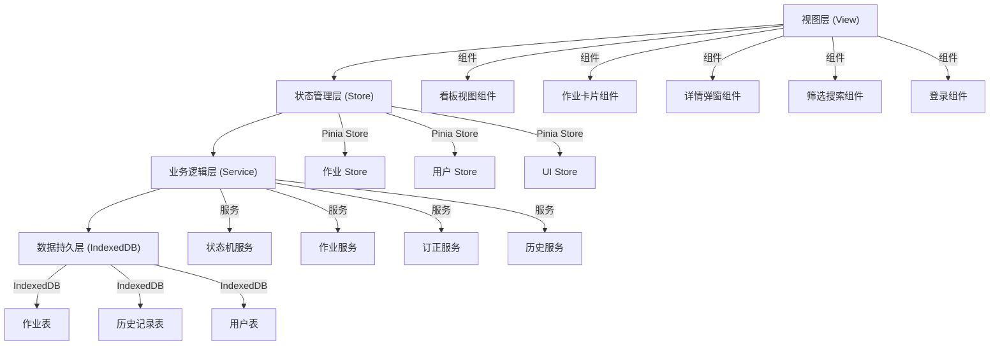
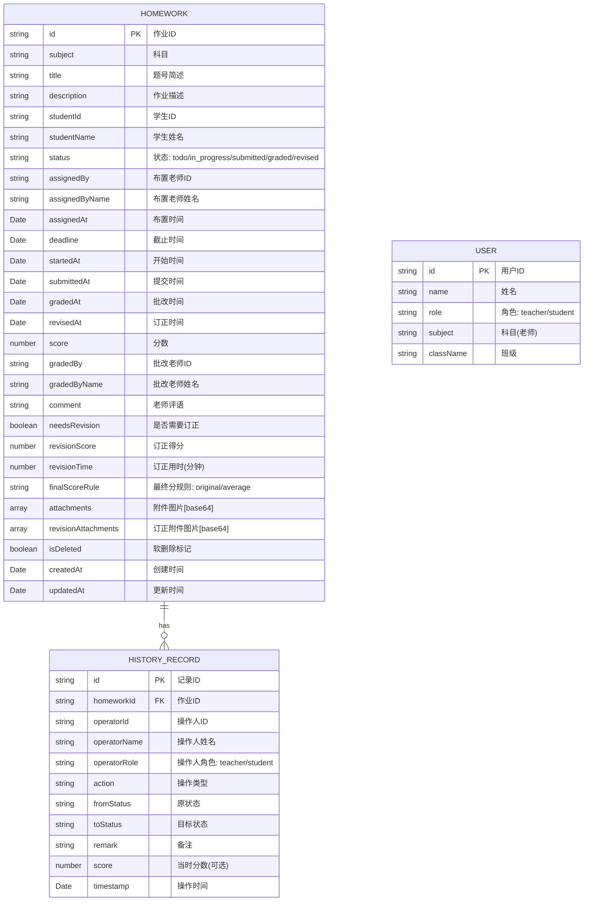

## 1. 架构设计

本项目为纯前端单页应用，数据存储在浏览器 IndexedDB 中，无需后端服务。整体采用分层架构，确保模块职责清晰、易于维护。



## 2. 技术选型

| 分类 | 技术 | 版本 | 说明 |
|------|------|------|------|
| 框架 | Vue | ^3.4.0 | Composition API + `<script setup>` |
| 构建工具 | Vite | ^5.0.0 | 快速开发构建 |
| 语言 | TypeScript | ^5.3.0 | 类型安全 |
| 样式 | Tailwind CSS | ^3.4.0 | 原子化 CSS |
| 状态管理 | Pinia | ^2.1.0 | Vue 官方状态管理 |
| 路由 | Vue Router | ^4.2.0 | 页面路由 |
| 拖拽 | vuedraggable | ^4.1.0 | 基于 Sortable.js 的 Vue 拖拽组件 |
| 图标 | lucide-vue-next | ^0.300.0 | 轻量图标库 |
| 数据存储 | IndexedDB | 原生 | 浏览器本地大容量存储 |
| ID 生成 | nanoid | ^5.0.0 | 轻量唯一 ID 生成 |

## 3. 目录结构

```
src/
├── components/          # 通用组件
│   ├── board/          # 看板相关组件
│   │   ├── KanbanBoard.vue
│   │   ├── KanbanColumn.vue
│   │   ├── HomeworkCard.vue
│   │   └── StudentGroup.vue
│   ├── common/         # 通用基础组件
│   │   ├── RoleBadge.vue
│   │   ├── SubjectTag.vue
│   │   ├── SearchInput.vue
│   │   ├── FilterDropdown.vue
│   │   └── Toast.vue
│   ├── dialog/         # 弹窗组件
│   │   ├── HomeworkDetailDialog.vue
│   │   ├── GradeDialog.vue
│   │   └── CreateHomeworkDialog.vue
│   └── timeline/       # 时间线组件
│       └── HistoryTimeline.vue
├── composables/        # 组合式函数
│   ├── useAuth.ts      # 身份权限相关
│   ├── useHomework.ts  # 作业相关
│   ├── useDragDrop.ts  # 拖拽相关
│   └── useToast.ts     # 提示消息
├── stores/             # Pinia 状态管理
│   ├── homework.ts     # 作业数据
│   ├── user.ts         # 用户/身份
│   └── ui.ts           # UI 状态
├── services/           # 业务逻辑服务
│   ├── stateMachine.ts # 状态机
│   ├── homeworkService.ts
│   ├── revisionService.ts
│   └── historyService.ts
├── db/                 # IndexedDB 封装
│   ├── index.ts        # DB 初始化
│   ├── homeworkDB.ts   # 作业表操作
│   ├── historyDB.ts    # 历史表操作
│   └── userDB.ts       # 用户表操作
├── types/              # TypeScript 类型定义
│   ├── homework.ts
│   ├── user.ts
│   └── history.ts
├── utils/              # 工具函数
│   ├── date.ts
│   ├── subject.ts
│   └── file.ts
├── views/              # 页面视图
│   ├── LoginView.vue
│   ├── TeacherBoardView.vue
│   └── StudentBoardView.vue
├── router/             # 路由配置
│   └── index.ts
├── App.vue
└── main.ts
```

## 4. 路由定义

| 路由 | 页面 | 说明 |
|------|------|------|
| `/login` | 登录页 | 选择身份和具体用户 |
| `/teacher` | 老师看板页 | 全班作业看板 |
| `/student` | 学生看板页 | 个人作业看板 |

## 5. 数据模型

### 5.1 核心数据结构



### 5.2 IndexedDB 存储设计

**数据库名**: `homework-board-db`

**对象仓库 (Object Stores)**:

1. **homeworks** - 作业表
   - 主键: `id`
   - 索引: `studentId`, `status`, `subject`, `assignedAt`, `deadline`

2. **historyRecords** - 历史记录表
   - 主键: `id`
   - 索引: `homeworkId`, `timestamp`, `operatorId`

3. **users** - 用户表
   - 主键: `id`
   - 索引: `role`, `name`

## 6. 状态机设计

### 6.1 状态定义

| 状态 | 标识 | 说明 |
|------|------|------|
| 待办 | `todo` | 老师布置但学生未开始 |
| 进行中 | `in_progress` | 学生开始但未提交 |
| 已提交 | `submitted` | 学生提交但老师未批 |
| 已批改 | `graded` | 老师批改完成 |
| 已订正 | `revised` | 学生订正完成 |

### 6.2 合法转移矩阵

| 源状态 → 目标状态 | 老师操作 | 学生操作 | 说明 |
|-------------------|----------|----------|------|
| todo → in_progress | ❌ | ✅ | 学生点击开始 |
| todo → submitted | ❌ | ✅ | 学生直接提交(跳过进行中) |
| todo → graded | ✅ 强制判0 | ❌ | 老师直接判0分 |
| in_progress → submitted | ❌ | ✅ | 学生提交作业 |
| in_progress → graded | ✅ 判0分 | ❌ | 老师给交白卷/未交判0 |
| submitted → graded | ✅ | ❌ | 老师批改作业 |
| graded → graded | ✅ 重批 | ❌ | 老师重新批改(覆盖分数) |
| graded → revised | ❌ | ✅ | 学生提交订正 |
| graded → submitted | ✅ 打回 | ❌ | 老师打回重做 |
| revised → graded | ✅ 打回订正 | ❌ | 老师打回重新订正 |
| revised → submitted | ✅ 打回重做 | ❌ | 老师打回重做(特殊) |

### 6.3 状态机核心逻辑

状态机服务 (`stateMachine.ts`) 提供核心校验函数：
- `canTransition(fromStatus, toStatus, role): boolean` - 判断是否允许转移
- `validateTransition(...): { valid: boolean; reason: string }` - 详细校验
- `getValidTransitions(status, role): string[]` - 获取可转移的状态列表

## 7. 模块职责

### 7.1 看板视图模块
- 负责 5 列布局渲染
- 作业卡片展示与交互
- 拖拽排序与状态转移
- 学生分组(老师端)

### 7.2 状态机模块
- 状态转移规则校验
- 非法转移拦截与提示
- 转移触发与记录

### 7.3 身份权限模块
- 登录/登出管理
- 角色身份切换
- 操作权限校验
- 视图差异化渲染

### 7.4 作业数据模块
- IndexedDB 封装与操作
- 作业 CRUD
- 图片附件存储
- 软删除管理

### 7.5 订正流程模块
- 订正卡自动生成(分数<60)
- 订正分数记录
- 订正用时统计
- 最终分数规则

### 7.6 流转历史模块
- 事件日志记录
- 历史回溯查询
- 时间线展示

### 7.7 筛选排序搜索模块
- 科目筛选
- 学生筛选(老师端)
- 状态筛选(学生端)
- 截止时间排序
- 关键字搜索
